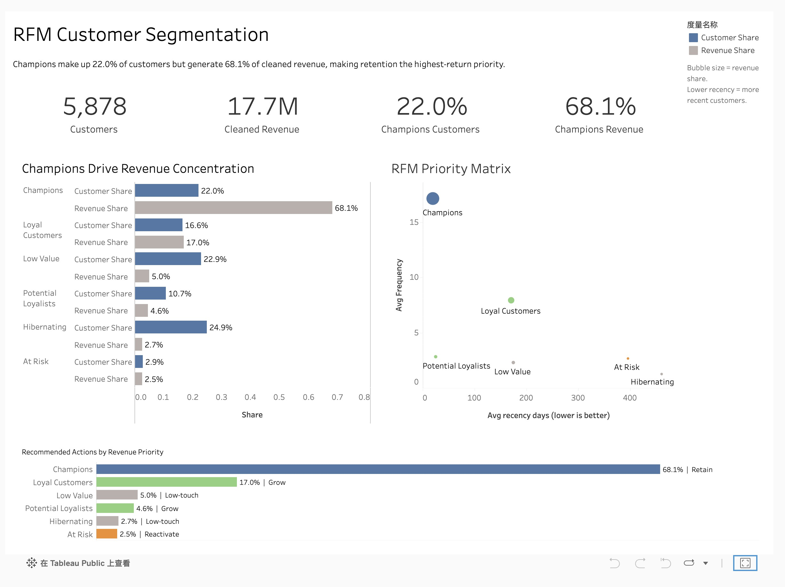
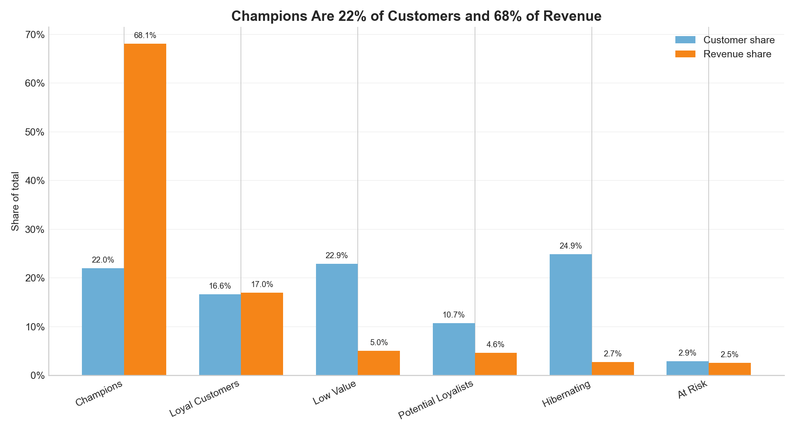
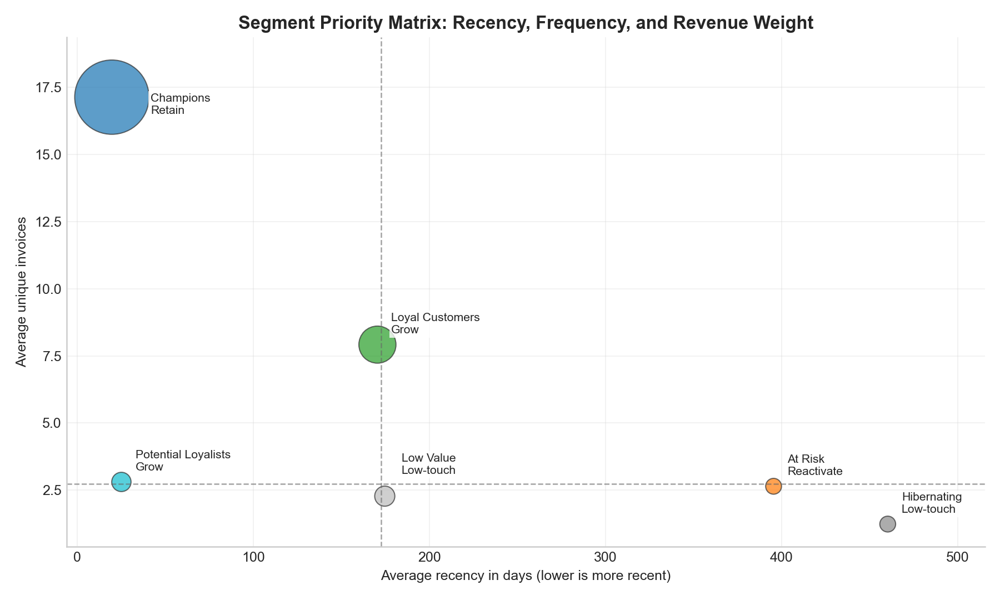
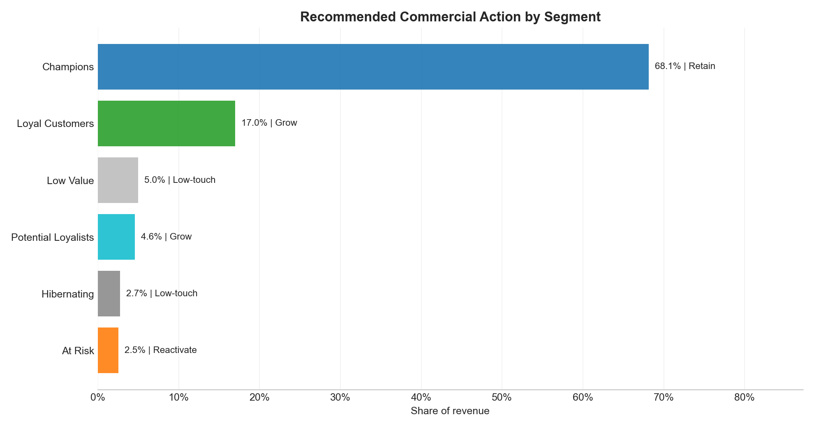

# RFM Customer Segmentation

## Project Context

This project is a public reconstruction of a customer segmentation workflow I developed from a real commercial analytics use case. Because the original business data is confidential, I rebuilt the analysis using the public UCI Online Retail II dataset while preserving the same analytical structure: transaction cleaning, RFM scoring, segment reporting, executive KPIs, and commercial action prioritisation.

The dataset is public, but the analytical design mirrors the original business problem: identifying high-value active customers, separating low-touch segments, and turning RFM outputs into stakeholder-ready recommendations.

## Executive Summary

This project analyses online retail transaction data to segment customers by recency, frequency, and monetary value. It demonstrates a customer analytics workflow that turns raw order lines into segment-level reporting for commercial prioritisation, retention planning, and stakeholder-ready decision support.

This public portfolio version uses the UCI Online Retail II dataset so the method can be reviewed and reproduced without exposing confidential business data.

## Tableau Dashboard



**[View on Tableau Public →](https://public.tableau.com/app/profile/zhuoxun.yang/viz/RFMCustomerSegmentation_17805150464680/RFMPortfolioDashboard?publish=yes)**

The Tableau dashboard presents the public reconstruction as an executive view: segment-level KPIs, revenue concentration evidence, RFM behaviour, and recommended commercial actions.

## Business Question

How can transaction history be converted into practical customer groups so marketing, service, and follow-up resources can be prioritised more deliberately?

## Data Source and Privacy

This public version uses the Online Retail II dataset from the UCI Machine Learning Repository.

- Source: https://archive.ics.uci.edu/dataset/502/online+retail+ii
- Citation: Chen, D. (2012). Online Retail II [Dataset]. UCI Machine Learning Repository. https://doi.org/10.24432/C5CG6D
- License: Creative Commons Attribution 4.0 International (CC BY 4.0)
- Dataset context: a UK-based online retail transaction dataset covering two years of transactions

The public dataset uses numeric customer identifiers and does not include direct personal contact details such as names, emails, phone numbers, addresses, or payment information. This project does not attempt to identify individual customers. Public outputs are aggregated at segment level.

The raw Excel file is not committed to this repository. Download instructions are in [data/README.md](data/README.md).

## What This Project Demonstrates

- Cleaning and preparing transaction-level customer data
- Removing cancellations, missing customer identifiers, and invalid transaction values
- Building customer-level Recency, Frequency, and Monetary metrics
- Creating interpretable customer segments from RFM scores
- Producing segment-level reporting tables and charts
- Translating analytical output into commercial actions

## Method and Workflow

```text
Online retail transactions
  -> data cleaning
  -> customer-level RFM aggregation
  -> R/F/M score creation
  -> segment assignment
  -> segment summary reporting
  -> business action table and charts
```

## Data Quality Summary

The workflow includes a cleaning audit so the row-level impact of each rule is visible.

| Cleaning Step | Rows Before | Rows After | Rows Removed |
|---|---:|---:|---:|
| Raw rows loaded | 1,067,371 | 1,067,371 | 0 |
| Remove missing required fields | 1,067,371 | 824,364 | 243,007 |
| Remove cancellation invoices | 824,364 | 805,620 | 18,744 |
| Remove non-positive quantity | 805,620 | 805,620 | 0 |
| Remove non-positive unit price | 805,620 | 805,549 | 71 |

Full output: [outputs/data_cleaning_summary.csv](outputs/data_cleaning_summary.csv)

## Metric Definitions

RFM metrics:

| Metric | Definition | Business use |
|---|---|---|
| Revenue | `Quantity * UnitPrice` | Calculates cleaned transaction value |
| Analysis Date | `max(InvoiceDate) + 1 day` | Reference date for recency |
| Recency | Analysis date minus latest purchase date | Identifies active vs. inactive customers |
| Frequency | Count of distinct invoices | Separates repeat customers from occasional buyers |
| Monetary | Sum of cleaned revenue | Highlights higher-value customer groups |
| R/F/M Scores | Quintile scores from Recency, Frequency, and Monetary | Creates comparable customer-level scoring |
| Segment | Business-readable grouping from R/F/M score combinations | Supports stakeholder reporting and action planning |

Full output: [outputs/metric_definitions.csv](outputs/metric_definitions.csv)

Segments used in the public version:

- Champions
- Loyal Customers
- Potential Loyalists
- At Risk
- Hibernating
- Low Value

## Example Output

The script generates aggregated output tables in `outputs/` and business-facing charts in `images/`.







Segment summary output:

| Segment | Customer Share | Revenue Share | Avg Recency Days | Avg Frequency |
|---|---:|---:|---:|---:|
| Champions | 22.0% | 68.1% | 19.7 | 17.1 |
| Loyal Customers | 16.6% | 17.0% | 170.5 | 7.9 |
| Potential Loyalists | 10.7% | 4.6% | 25.1 | 2.8 |
| At Risk | 2.9% | 2.5% | 395.5 | 2.6 |
| Hibernating | 24.9% | 2.7% | 460.3 | 1.2 |
| Low Value | 22.9% | 5.0% | 174.7 | 2.3 |

Additional outputs:

- [outputs/customer_segment_summary.csv](outputs/customer_segment_summary.csv)
- [outputs/segment_action_table.csv](outputs/segment_action_table.csv)
- [outputs/executive_summary.md](outputs/executive_summary.md)

## Key Findings

1. Champions make up about 22% of customers but contribute about 68% of revenue, making them the clearest retention priority.
2. Loyal Customers contribute another 17% of revenue and show higher repeat-purchase behaviour than most other segments, making them suitable for loyalty and cross-sell actions.
3. Potential Loyalists are very recent customers with lower frequency, suggesting an opportunity to increase repeat purchasing through onboarding or targeted follow-up.
4. At Risk customers are a small segment but have relatively high average monetary value and weak recent activity, making them candidates for reactivation review.
5. Hibernating and Low Value customers represent a large share of customers but a small share of revenue, which supports lower-cost automated follow-up rather than high-touch service.

## Business Implication

The analysis supports a more targeted customer management approach:

- Protect high-value active customers through retention and relationship-quality monitoring.
- Grow recent but lower-frequency customers through onboarding and product recommendations.
- Review historically valuable but inactive customers for reactivation campaigns.
- Separate lower-value inactive groups from high-touch commercial follow-up.
- Use segment-level reporting as a recurring commercial KPI view.

## Executive Insight Memo

A stakeholder-style one-page summary is available in [outputs/executive_summary.md](outputs/executive_summary.md). It summarises the business question, key result, recommended actions, reporting notes, and supporting segment metrics.

## Repository Structure

```text
data/
  README.md
scripts/
  rfm_analysis.py
outputs/
  data_cleaning_summary.csv
  metric_definitions.csv
  customer_segment_summary.csv
  segment_action_table.csv
  executive_summary.md
  rfm_customers.csv
images/
  tableau_rfm_dashboard.png
  rfm_customer_revenue_mix.png
  rfm_priority_matrix.png
  rfm_action_priority.png
kmeans.py
README.md
requirements.txt
```

`scripts/rfm_analysis.py` is the public reproducible analysis workflow. `kmeans.py` is retained as the original legacy workflow from the private operational analysis context.

## How to Run

Install dependencies:

```bash
pip install -r requirements.txt
```

Download `online_retail_II.xlsx` from UCI and place it here:

```text
data/raw/online_retail_II.xlsx
```

Run the public RFM workflow:

```bash
python scripts/rfm_analysis.py --input data/raw/online_retail_II.xlsx
```

Generated files:

```text
outputs/data_cleaning_summary.csv
outputs/metric_definitions.csv
outputs/customer_segment_summary.csv
outputs/segment_action_table.csv
outputs/executive_summary.md
images/rfm_customer_revenue_mix.png
images/rfm_priority_matrix.png
images/rfm_action_priority.png
outputs/rfm_customers.csv  (individual-level RFM scores, used for Tableau dashboard)
```

## Limitations

- This public version uses UCI public retail data, not the original private operational dataset.
- Segment definitions are designed for portfolio demonstration and business interpretability, not as a final CRM production model.
- The analysis does not prove campaign impact; it identifies customer groups that could support prioritisation, reporting, and follow-up planning.

## Toolkit

- **Languages:** Python · SQL
- **Business Intelligence:** Tableau · Power BI · Excel · dashboarding · KPI reporting
- **Data Analysis:** pandas · data cleaning · exploratory analysis · customer segmentation
- **Visualization:** Tableau · Power BI · matplotlib
- **Workflow:** Jupyter Notebook · Git · GitHub
